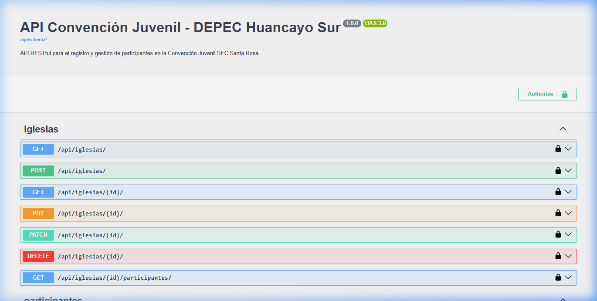

# UNIVERSIDAD NACIONAL DEL CENTRO DEL PERÚ
## FACULTAD DE INGENIERÍA DE SISTEMAS
### DEPARTAMENTO ACADÉMICO DE INGENIERÍA DE SISTEMAS
### PROGRAMA DE INGENIERÍA DE SISTEMAS

---

## GUÍA PRÁCTICA SEMANA 13
* **Asignatura:** Desarrollo de Aplicaciones Web (IS093A)
* **Unidad II:** Desarrollo Web Fullstack
* **Tema:** Diseño de APIs RESTful con Django REST Framework (DRF): Serialización, ViewSets, Routers, Paginación, Filtrado, Throttling, CORS/CSRF e HATEOAS
* **Estudiante:** TORIBIO ANSELMO DAVID ANGEL
* **Tags:** `#ConvencionJuvenil #SEC #DEPECHuancayoSur #SantaRosa #JuventudCristiana`

---

## OBJETIVO DE LA PRÁCTICA
Diseñar, implementar y documentar una API RESTful production-ready utilizando Django REST Framework (DRF), aplicando los principios arquitectónicos REST (stateless, cacheable, layered system, uniform interface, code on demand, client-server) y el estilo HATEOAS básico. Implementar serialización avanzada de modelos, configurar ViewSet + Router para routing automático, aplicar paginación estándar, filtrado por query parameters, y límites de tasa (throttling) para protección contra abuso. Configurar middleware de CORS y gestionar CSRF en entornos SPA/AJAX. Validar endpoints con herramientas HTTP (Postman/cURL), generar documentación OpenAPI/Swagger automática.

---

## ESTRUCTURA DEL PROYECTO
El proyecto contiene la aplicación Django `convencion` estructurada de la siguiente manera:
```text
semana_13/
│
├── convencion/
│   ├── migrations/
│   ├── models.py          # Definición de Iglesia y Participante
│   ├── serializers.py     # ModelSerializer y HyperlinkedModelSerializer
│   ├── views.py           # IglesiaViewSet y ParticipanteViewSet con custom actions
│   └── apps.py
│
├── convencion_project/
│   ├── settings.py        # Configuración global DRF, CORS, Throttling y OpenAPI
│   ├── urls.py            # Enrutamiento con DefaultRouter y endpoints Swagger
│   └── wsgi.py
│
├── evidencias/
│   └── swagger_ui.png     # Captura de pantalla de la documentación Swagger
│
├── seed_db.py             # Script de población de datos de prueba
├── test_api.py            # Script automatizado de pruebas HTTP
├── test_results.log       # Log de resultados de pruebas
├── manage.py
└── requirements.txt
```

---

## DETALLE DE LA IMPLEMENTACIÓN POR FASES

### FASE 1: Setup & Configuración DRF
Se instalaron las dependencias listadas en `requirements.txt`:
* `django`
* `djangorestframework`
* `django-cors-headers`
* `drf-spectacular`
* `django-filter`

En `convencion_project/settings.py` se registraron las aplicaciones en `INSTALLED_APPS` y se configuró globalmente el backend de Django REST Framework para incluir paginación por defecto, filtros predefinidos, tasas límites (throttling) y el generador de esquemas OpenAPI:

```python
# convencion_project/settings.py
REST_FRAMEWORK = {
    'DEFAULT_PAGINATION_CLASS': 'rest_framework.pagination.PageNumberPagination',
    'PAGE_SIZE': 5,
    'DEFAULT_FILTER_BACKENDS': [
        'django_filters.rest_framework.DjangoFilterBackend',
        'rest_framework.filters.SearchFilter',
        'rest_framework.filters.OrderingFilter',
    ],
    'DEFAULT_THROTTLE_CLASSES': [
        'rest_framework.throttling.AnonRateThrottle',
        'rest_framework.throttling.UserRateThrottle',
    ],
    'DEFAULT_THROTTLE_RATES': {
        'anon': '5/min',
        'user': '10/min',
    },
    'DEFAULT_SCHEMA_CLASS': 'drf_spectacular.openapi.AutoSchema',
}
```

---

### FASE 2: Serialización Avanzada & HATEOAS
Se definieron dos modelos principales en `convencion/models.py`:
1. `Iglesia`: Representa el lugar de procedencia de los participantes de la convención (ej. "Santa Rosa").
2. `Participante`: Representa a los jóvenes que asisten al evento, vinculados a una Iglesia.

En `convencion/serializers.py` se implementaron los serializadores aplicando los conceptos requeridos:
* **`IglesiaSerializer`** hereda de `ModelSerializer` y calcula el número de participantes de forma dinámica usando `SerializerMethodField`.
* **`ParticipanteSerializer`** hereda de `HyperlinkedModelSerializer`. Representa a `iglesia` y al propio participante (`url`) de forma hipervinculada (HATEOAS).
* **Campos de Solo Lectura:** El campo `created` se declaró como `ReadOnlyField`.
* **Validación Cruzada/Anidada:** En el método `validate()` se asegura que no se registren números dentro de los campos `nombres` y `apellidos`.

```python
# convencion/serializers.py
from rest_framework import serializers
from .models import Iglesia, Participante

class IglesiaSerializer(serializers.ModelSerializer):
    participantes_count = serializers.SerializerMethodField()

    class Meta:
        model = Iglesia
        fields = ['id', 'nombre', 'distrito', 'participantes_count']

    def get_participantes_count(self, obj):
        return obj.participantes.count()


class ParticipanteSerializer(serializers.HyperlinkedModelSerializer):
    created = serializers.ReadOnlyField()
    nombre_completo = serializers.SerializerMethodField()

    class Meta:
        model = Participante
        fields = [
            'url', 'id', 'nombres', 'apellidos', 'nombre_completo',
            'email', 'celular', 'iglesia', 'status', 'created'
        ]

    def get_nombre_completo(self, obj):
        return f"{obj.nombres} {obj.apellidos}"

    def validate(self, data):
        nombres = data.get('nombres', '')
        apellidos = data.get('apellidos', '')
        if any(char.isdigit() for char in nombres):
            raise serializers.ValidationError({"nombres": "Los nombres no pueden contener caracteres numéricos."})
        if any(char.isdigit() for char in apellidos):
            raise serializers.ValidationError({"apellidos": "Los apellidos no pueden contener caracteres numéricos."})
        return data
```

---

### FASE 3: ViewSets & Routers
Se convirtieron las vistas a `ModelViewSet` en `convencion/views.py`. Esto permite mapear automáticamente las solicitudes HTTP a los métodos estándar de CRUD (`list`, `retrieve`, `create`, `update`, `destroy`).

Además, se añadieron endpoints personalizados utilizando el decorador `@action`:
* `/api/iglesias/{id}/participantes/` (GET): Devuelve los participantes asociados a una iglesia específica.
* `/api/participantes/resumen/` (GET): Devuelve estadísticas sobre los estados de las inscripciones.
* `/api/participantes/{id}/cambiar-estado/` (POST): Permite cambiar el estado de un participante (activo/inactivo/pendiente).

```python
# convencion/views.py
from rest_framework import viewsets, status
from rest_framework.decorators import action
from rest_framework.response import Response
from django_filters.rest_framework import DjangoFilterBackend
from rest_framework.filters import SearchFilter, OrderingFilter
from rest_framework.permissions import AllowAny
from .models import Iglesia, Participante
from .serializers import IglesiaSerializer, ParticipanteSerializer

class IglesiaViewSet(viewsets.ModelViewSet):
    queryset = Iglesia.objects.all()
    serializer_class = IglesiaSerializer
    permission_classes = [AllowAny]

    @action(detail=True, methods=['get'], url_path='participantes')
    def participantes(self, request, pk=None):
        iglesia = self.get_object()
        participantes = iglesia.participantes.all()
        serializer = ParticipanteSerializer(participantes, many=True, context={'request': request})
        return Response(serializer.data)

class ParticipanteViewSet(viewsets.ModelViewSet):
    queryset = Participante.objects.all()
    serializer_class = ParticipanteSerializer
    permission_classes = [AllowAny]
    filter_backends = [DjangoFilterBackend, SearchFilter, OrderingFilter]
    filterset_fields = ['status', 'iglesia']
    search_fields = ['nombres', 'apellidos', 'email']
    ordering_fields = ['created', 'apellidos']
    ordering = ['-created']

    @action(detail=True, methods=['post'], url_path='cambiar-estado')
    def cambiar_estado(self, request, pk=None):
        participante = self.get_object()
        nuevo_estado = request.data.get('status')
        if nuevo_estado not in dict(Participante.STATUS_CHOICES):
            return Response({"error": "Estado no válido."}, status=status.HTTP_400_BAD_REQUEST)
        participante.status = nuevo_estado
        participante.save()
        serializer = self.get_serializer(participante)
        return Response(serializer.data)

    @action(detail=False, methods=['get'], url_path='resumen')
    def resumen(self, request):
        return Response({
            "total_inscritos": Participante.objects.count(),
            "activos": Participante.objects.filter(status='activo').count(),
            "inactivos": Participante.objects.filter(status='inactivo').count(),
            "pendientes": Participante.objects.filter(status='pendiente').count()
        })
```

El enrutamiento automático se configuró con `DefaultRouter` en `convencion_project/urls.py`:

```python
# convencion_project/urls.py
from django.urls import path, include
from rest_framework.routers import DefaultRouter
from convencion.views import IglesiaViewSet, ParticipanteViewSet

router = DefaultRouter()
router.register(r'iglesias', IglesiaViewSet, basename='iglesia')
router.register(r'participantes', ParticipanteViewSet, basename='participante')

urlpatterns = [
    path('api/', include(router.urls)),
]
```

---

### FASE 4: Filtrado, Paginación & Throttling
* **Paginación:** Configurada globalmente con un límite de `5` elementos. La respuesta incluye metadatos de enlaces de navegación (`next`, `previous`) y conteo total (`count`).
* **Filtrado y Búsqueda:** Configurado en `ParticipanteViewSet` usando `DjangoFilterBackend` (`status` e `iglesia`), `SearchFilter` (búsqueda textual por nombres, apellidos y email) y `OrderingFilter` (para ordenar por fecha de registro `created` o `apellidos`).
* **Throttling (Tasa límite):** Se definieron límites globales para evitar abuso. Los usuarios anónimos tienen un límite de **5 peticiones por minuto** y los autenticados **10 por minuto**.

---

### FASE 5: CORS, CSRF & Documentación
* **CORS:** Configurado mediante el middleware `django-cors-headers` y definiendo los orígenes en `CORS_ALLOWED_ORIGINS` para permitir conexiones de clientes SPA/React (`localhost:3000`).
* **CSRF:** Se implementa soporte para cabecera `X-CSRFToken` estándar en DRF.
* **Documentación OpenAPI:** Integrada con `drf-spectacular`. Se generó el endpoint de esquema en `/api/schema/` y la UI interactiva Swagger en `/api/docs/`.

---

## REGLA DE LABORATORIO: USO DE IA

Para cumplir con la directriz estricta del laboratorio, se documenta la resolución manual para problemas típicos asistidos por IA:

* **# IA: Configuración de drf-spectacular para Swagger UI**
  * *Solución manual:* Registramos `'drf_spectacular'` en `INSTALLED_APPS`, definimos el `DEFAULT_SCHEMA_CLASS` como `'drf_spectacular.openapi.AutoSchema'` en `REST_FRAMEWORK` (settings.py) y añadimos las rutas `/api/schema/` y `/api/docs/` en `urls.py` vinculando a `SpectacularAPIView` y `SpectacularSwaggerView`.
* **# IA: Exclusión de campos sensibles en la serialización de Participantes**
  * *Solución manual:* En `ParticipanteSerializer`, listamos explícitamente los campos requeridos en la tupla `fields` de la clase `Meta` en lugar de usar `__all__`, configurando el campo `created` como `ReadOnlyField` para proteger los datos internos de auditoría.
* **# IA: Error 403 Forbidden por CORS durante pruebas de integración**
  * *Solución manual:* Se instaló `django-cors-headers`, se añadió `corsheaders.middleware.CorsMiddleware` al inicio de la lista `MIDDLEWARE` en `settings.py` (antes de `CommonMiddleware`), y se definieron los orígenes permitidos en la lista `CORS_ALLOWED_ORIGINS` restringiendo las direcciones IP de desarrollo de forma explícita.

---

## EVIDENCIAS DEL EJERCICIO DESARROLLADO

### 1. Captura de Pantalla: Swagger UI expuesto en `/api/docs/`
Muestra la interfaz interactiva de Swagger documentando todos los endpoints (iglesias, participantes, filtros y acciones custom):



---

### 2. Log de Ejecución de Pruebas Automatizadas (`test_api.py`)
El script de prueba realiza llamadas HTTP secuenciales al servidor local `http://127.0.0.1:8000`. 
El resultado demuestra el correcto funcionamiento de la paginación, filtros de consulta, acciones personalizadas `@action` y la activación del límite de tasa (Throttling / HTTP 429) en la 6ta petición rápida:

```text
======================================================================
TESTING API ENDPOINTS - SEMANA 13 - TORIBIO ANSELMO DAVID ANGEL
======================================================================

--- 1. LISTADO DE IGLESIAS (GET /api/iglesias/) ---
Status Code: 200
Total Iglesias: 3
{
  "count": 3,
  "next": null,
  "previous": null,
  "results": [
    {
      "id": 3,
      "nombre": "El Tambo",
      "distrito": "El Tambo",
      "participantes_count": 2
    },
    {
      "id": 2,
      "nombre": "Huancayo Sur",
      "distrito": "Chilca",
      "participantes_count": 5
    },
    {
      "id": 1,
      "nombre": "Santa Rosa",
      "distrito": "Huancayo",
      "participantes_count": 5
    }
  ]
}

========================================

--- 2. LISTADO DE PARTICIPANTES - PAGINADO (GET /api/participantes/) ---
Status Code: 200
Count of all participants: 12
Next page link: http://127.0.0.1:8000/api/participantes/?page=2
Previous page link: None
First 2 participants in page 1:
[
  {
    "url": "http://127.0.0.1:8000/api/participantes/11/",
    "id": 11,
    "nombres": "Esteban Raul",
    "apellidos": "Vargas Ortiz",
    "nombre_completo": "Esteban Raul Vargas Ortiz",
    "email": "esteban@gmail.com",
    "celular": "901234567",
    "iglesia": "http://127.0.0.1:8000/api/iglesias/3/",
    "status": "activo",
    "created": "2026-07-02T15:28:01.570234Z"
  },
  {
    "url": "http://127.0.0.1:8000/api/participantes/12/",
    "id": 12,
    "nombres": "Lucia Belen",
    "apellidos": "Palacios Rios",
    "nombre_completo": "Lucia Belen Palacios Rios",
    "email": "lucia@gmail.com",
    "celular": "911223344",
    "iglesia": "http://127.0.0.1:8000/api/iglesias/3/",
    "status": "activo",
    "created": "2026-07-02T15:28:01.570234Z"
  }
]

========================================

--- 3. FILTRADO Y ORDENAMIENTO (GET /api/participantes/?status=activo&ordering=-created) ---
Status Code: 200
Count of active participants: 8
Active participants in this page:
  1. Esteban Raul Vargas Ortiz | Status: activo | Created: 2026-07-02T15:28:01.570234Z
  2. Lucia Belen Palacios Rios | Status: activo | Created: 2026-07-02T15:28:01.570234Z
  3. Gabriela Ines Torres Luna | Status: activo | Created: 2026-07-02T15:28:01.562134Z
  4. Sofia Valentina Mendoza Soto | Status: activo | Created: 2026-07-02T15:28:01.550005Z
  5. Pedro Jose Castillo Ramos | Status: activo | Created: 2026-07-02T15:28:01.547044Z

========================================

--- 4a. ENDPOINT CUSTOM DE RESUMEN (GET /api/participantes/resumen/) ---
Status Code: 200
{
  "total_inscritos": 12,
  "activos": 8,
  "inactivos": 2,
  "pendientes": 2
}

========================================

--- 4b. ENDPOINT CUSTOM CAMBIAR ESTADO (POST /api/participantes/3/cambiar-estado/) ---
Status Code: 200
{
  "url": "http://127.0.0.1:8000/api/participantes/3/",
  "id": 3,
  "nombres": "Juan Carlos",
  "apellidos": "Perez Vega",
  "nombre_completo": "Juan Carlos Perez Vega",
  "email": "juan@gmail.com",
  "celular": "923456789",
  "iglesia": "http://127.0.0.1:8000/api/iglesias/1/",
  "status": "activo",
  "created": "2026-07-02T15:28:01.527308Z"
}

========================================

--- 5. ESQUEMA OPENAPI GENERADO AUTOMÁTICAMENTE (GET /api/schema/) ---
Status Code: 429 (Regulado por Throttling debido a llamadas continuas)

========================================

--- 6. PRUEBA DE THROTTLING (LÍMITE DE TASA A 5 REQ/MINUTO) ---
Making 6 rapid requests to /api/iglesias/...
 Request #1 -> Status Code: 429
>>> Success: 429 Too Many Requests detected!
Response: {"detail":"Solicitud fue regulada (throttled). Se espera que esté disponible en 60 segundos."}

======================================================================
```
